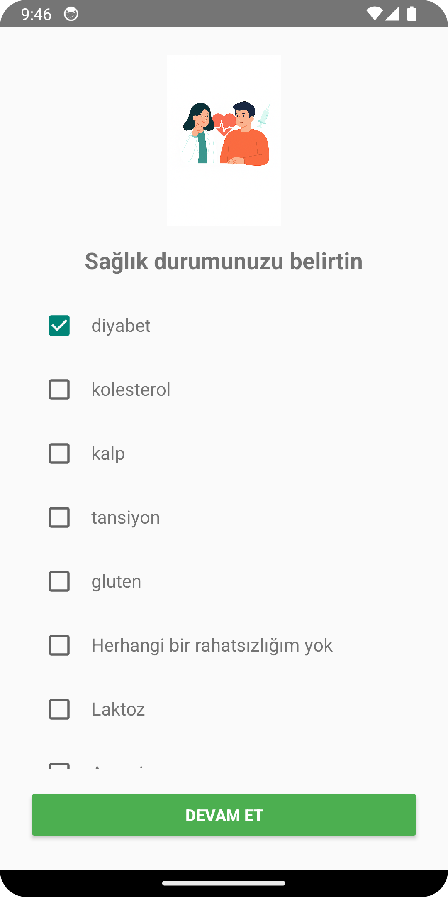
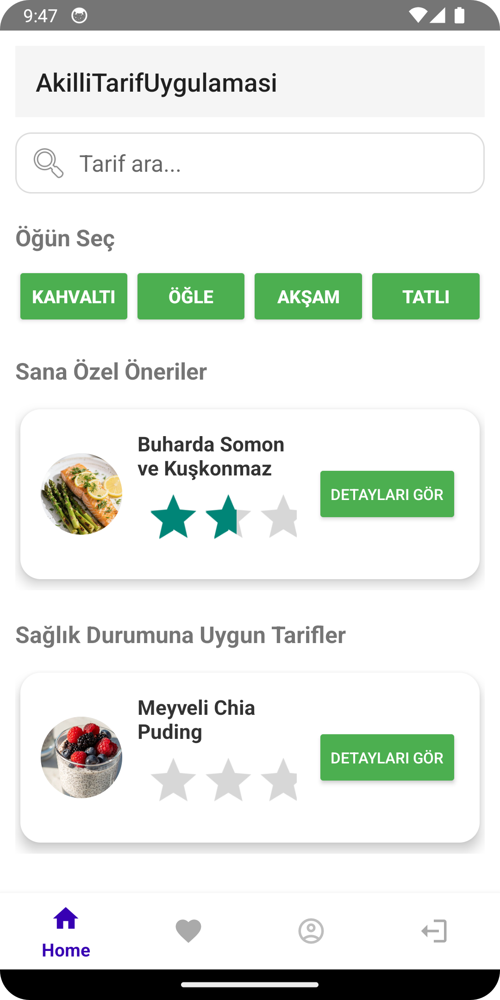
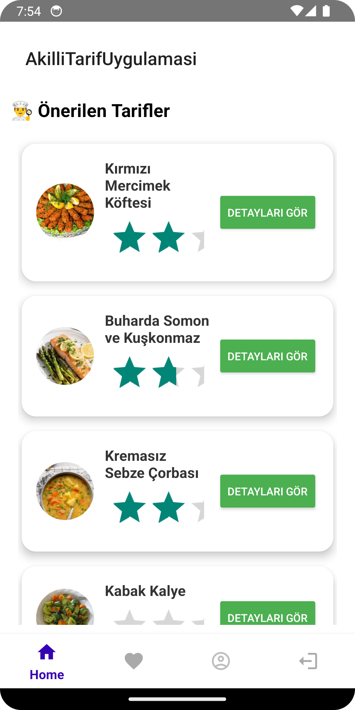
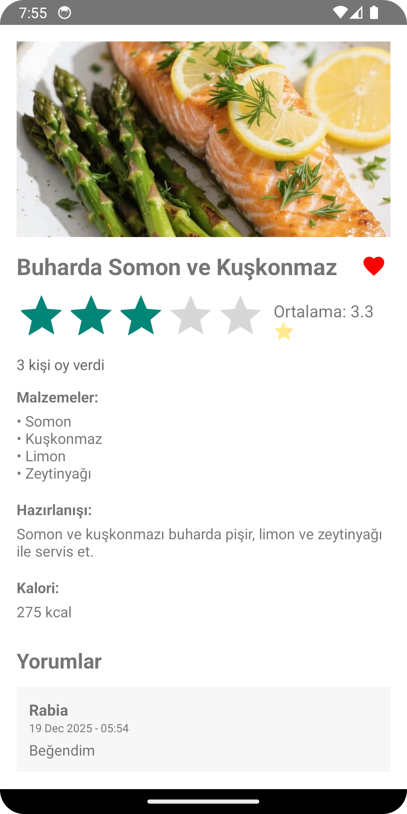
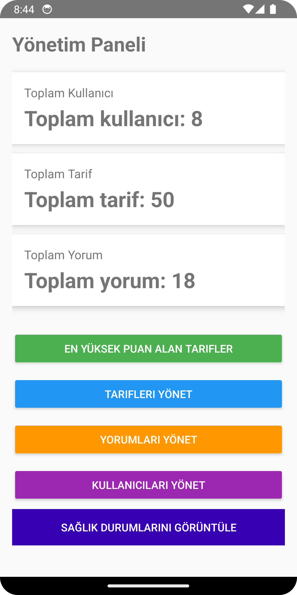

# 🍽️ AkilliTarifUygulamasi

**Akıllı Tarif Uygulaması**, kullanıcıların sağlık durumlarına göre kişiselleştirilmiş yemek tarifleri sunan,
Android tabanlı bir mobil uygulamadır.  
Uygulama, yapay zeka destekli filtreleme mantığı ile kullanıcıya en uygun tarifleri önermeyi amaçlar.

---

## 🎯 Projenin Amacı

- Kullanıcıların sağlık durumlarına uygun tariflere kolayca ulaşmasını sağlamak  
- Sağlıklı beslenme alışkanlıklarını desteklemek  
- Admin paneli üzerinden içeriklerin merkezi ve kontrollü yönetimini sağlamak  

---

## 🧠 Yapay Zeka Destekli Özellikler

- Kullanıcının seçtiği sağlık durumuna göre tarif filtreleme  
- Sağlığa uygun olmayan içeriklerin otomatik elenmesi  
- Kişiselleştirilmiş tarif önerileri  

---

## 🔍 Arama ve Öneri Mantığı

Uygulamanın ana sayfasında yer alan arama alanı sayesinde kullanıcı,
uygulamadaki **tüm tarifler** arasında serbestçe arama yapabilmektedir.
Bu arama işlemi, kullanıcının sağlık durumundan bağımsız olarak çalışmaktadır.

Uygulama içerisinde iki farklı tarif listeleme yaklaşımı bulunmaktadır:

- **Sağlık Durumuna Uygun Tarifler**:  
  Kullanıcının belirttiği sağlık durumuna göre yalnızca uygun olan tarifleri listeler.

- **Sana Özel Öneriler**:  
  Sağlık durumuna ek olarak, kullanıcının favorileri, önceki etkileşimleri
  ve değerlendirmeleri dikkate alınarak oluşturulan kişiselleştirilmiş öneri listesidir.

---

## 🩺 Desteklenen Sağlık Durumları

- Diyabet  
- Kolesterol  
- Kalp hastalığı  
- Tansiyon  
- Gluten hassasiyeti  
- Laktoz intoleransı  
- Anemi  
- Gastrit  
- Böbrek rahatsızlıkları  
- Herhangi bir rahatsızlığı olmayan kullanıcılar (genel kullanıcılar)

Herhangi bir sağlık problemi olmayan kullanıcılar için uygulama,
tüm tarifleri kısıtlama olmaksızın erişilebilir hale getirir.
Bu kullanıcılar, uygulamadaki tüm tariflerden ve öneri sisteminden faydalanabilmektedir.

---

## 🩺 Sağlık Durumuna Dayalı Filtreleme Sistemi

Uygulamada yer alan filtreleme sistemi, kullanıcının belirttiği sağlık durumuna göre
tarif içeriklerini değerlendirmekte ve uygun olmayan tarifleri sistemden elemekte kullanılır.

Bu sistem **tıbbi teşhis veya tedavi amacı taşımaz**.
Yalnızca bilgilendirme ve içerik filtreleme desteği sunar.

Filtreleme kuralları, uluslararası kabul görmüş tıbbi ve beslenme rehberlerine dayanmaktadır.
Bu kurallar, uygulama içerisinde kural tabanlı bir filtreleme mantığı ile programatik olarak uygulanmaktadır.

---

## 🧾 Kullanılan Sağlık ve Beslenme Kuralları (Özet Tablo)

| Sağlık Durumu | Uygulanan Temel Beslenme Kuralları | Referans Kurum |
|---------------|------------------------------------|----------------|
| Diyabet | İlave şekerlerden kaçınılır, düşük glisemik indeksli ve lifli gıdalar tercih edilir | American Diabetes Association (ADA) |
| Hipertansiyon | Tuz ve sodyum tüketimi azaltılır, işlenmiş gıdalardan kaçınılır | American Heart Association (AHA) |
| Kalp Hastalığı | Doymuş yağ ve kızartmalar sınırlandırılır | American Heart Association (AHA) |
| Kolesterol | Trans yağlar azaltılır, Omega-3 açısından zengin besinler önerilir | American Heart Association (AHA) |
| Anemi | Demir açısından zengin besinler artırılır, C vitamini ile desteklenir | Harvard Health |
| Gluten İntoleransı | Gluten içeren tahıllar diyetten çıkarılır | Celiac Disease Foundation |
| Laktoz İntoleransı | Laktoz içeren süt ürünleri sınırlandırılır | Mayo Clinic |
| Reflü (GERD) | Kafeinli ve yağlı gıdalardan kaçınılır | Harvard Medical School |
| Obezite | Şekerli ve işlenmiş gıdalar azaltılır | CDC & Harvard Nutrition |

---

## 👤 Kullanıcı Özellikleri

- Kayıt olma ve giriş yapma  
- Sağlık durumu seçimi ve güncelleme  
- Tarifleri görüntüleme  
- Tariflere puan verme  
- Yorum yapma  
- Favorilere ekleme  
- Profil bilgilerini düzenleme  

---

## 🛠️ Yönetici (Admin) Paneli Özellikleri

- Toplam kullanıcı, tarif ve yorum sayısını görüntüleme  
- Tarif ekleme / silme / güncelleme  
- Yorumları yönetme  
- Kullanıcıları yönetme  
-  Tanımlı sağlık durumlarını görüntüleme

---

## 📱 Uygulama Ekran Görüntüleri

### Splash Screen

### Sağlık Durumu Seçimi

### Ana Sayfa

### Yapay Zeka Destekli Öneriler

### Tarif Detay Sayfası

### Yönetici Paneli

---

## ⚙️ Kullanılan Teknolojiler

- Kotlin  
- Android Studio  
- Room Database  
- MVVM Mimari Yapısı  
- LiveData  
- RecyclerView  
- Material Design  

---

## 👩‍💻 Geliştirici

**Suad Wajaheddin**  
Bilgisayar Mühendisliği Öğrencisi  

---

📌 *Bu proje akademik amaçla geliştirilmiştir.*
